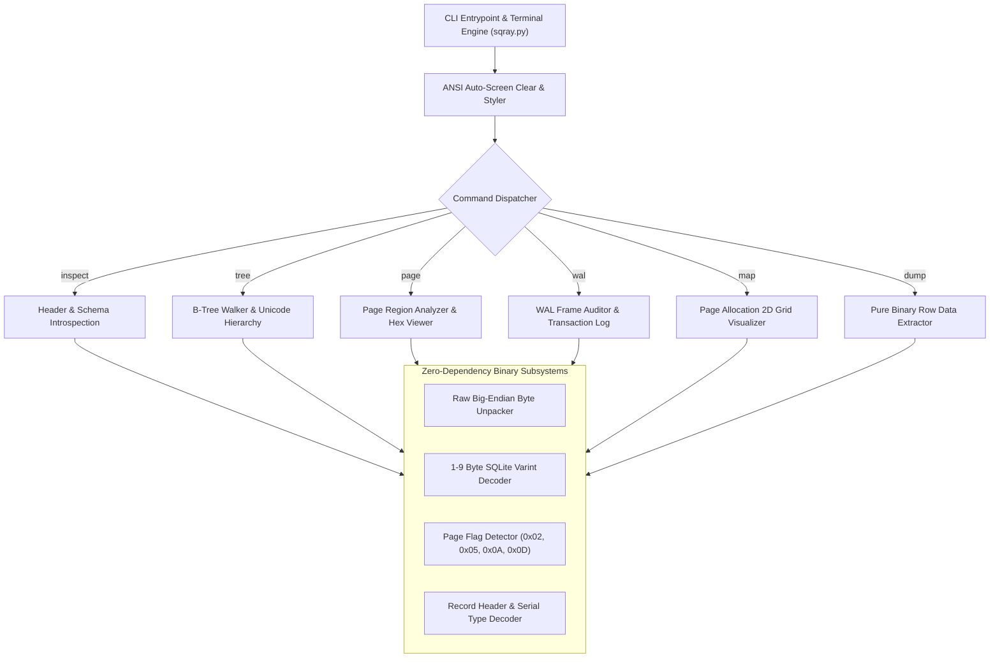

<div align="center">

```
  ███████╗ ██████╗ ██████╗  █████╗ ██╗   ██╗
  ██╔════╝██╔═══██╗██╔══██╗██╔══██╗╚██╗ ██╔╝
  ███████╗██║   ██║██████╔╝███████║ ╚████╔╝ 
  ╚════██║██║▄▄ ██║██╔══██╗██╔══██║  ╚██╔╝  
  ███████║╚██████╔╝██║  ██║██║  ██║   ██║   
  ╚══════╝ ╚══▀▀═╝ ╚═╝  ╚═╝╚═╝  ╚═╝   ╚═╝   
```

# ⚡ SQRay (SQLite-Xray)
### *A High-Performance, Zero-Dependency Terminal SQLite Deep-Inspection & B-Tree Visualizer*

[](https://python.org)
[-00C853?style=for-the-badge&logo=shield)](STDLIB.md)
[](sqray.py)
[](LICENSE)

<p align="center">
  <b>Read raw SQLite files byte-by-byte. Traverse B-Trees, inspect page geometries, decode records, and audit WAL frames directly in your terminal without any database drivers or external packages.</b>
</p>

---

</div>

## 📑 Table of Contents

- [Overview & The "Zero Dependency" Rule](#-overview--the-zero-dependency-rule)
- [System Architecture](#-system-architecture)
- [Key Features](#-key-features)
- [Getting Started](#-getting-started)
- [Command Reference & Visual Previews](#-command-reference--visual-previews)
  - [`inspect` — 100-Byte Header & Schema Introspector](#1-sqray-inspect-file)
  - [`tree` — Hierarchical B-Tree Visualizer](#2-sqray-tree-file-options)
  - [`page` — Page Region Breakdown & Hex Dump](#3-sqray-page-file-page_num-options)
  - [`wal` — Write-Ahead Log & Frame Forensics](#4-sqray-wal-file)
  - [`map` — 2D Page Allocation Grid Map](#5-sqray-map-file)
  - [`dump` — Driverless Binary Table Extraction](#6-sqray-dump-file-table-options)
- [Test Fixture Generator](#-test-fixture-generator)
- [Under the Hood: SQLite Binary Internals](#-under-the-hood-sqlite-binary-internals)
- [Honest Limits & Engineering Disclosures](#-honest-limits--engineering-disclosures)
- [License](#-license)

---

## 🛡️ Overview & The "Zero Dependency" Rule

**SQRay** is a bare-metal terminal utility designed for **strict zero-dependency hackathon environments**. It does not use any third-party runtime libraries, frameworks, or database drivers (`no pip`, `no npm`, `no cargo`).

Instead of issuing high-level SQL queries through an abstraction driver, SQRay implements the **SQLite File Format 3 Specification** directly using only Python's standard library (`struct`, `os`, `sys`, `dataclasses`, `enum`).

```
┌──────────────────────────────────────────────────────────────────────────┐
│                   TRADITIONAL SQL DRIVER vs. SQRAY                      │
├─────────────────────────────────────┬────────────────────────────────────┤
│ Native SQL Drivers (sqlite3 / C)    │ SQRay Binary Inspection Engine     │
├─────────────────────────────────────┼────────────────────────────────────┤
│ ❌ Hides physical page offsets      │ ✅ Inspects exact byte positions   │
│ ❌ Cannot see unallocated space     │ ✅ Maps free space gaps & fragments│
│ ❌ Abstracts away B-Tree pointers   │ ✅ Visualizes interior & leaf nodes│
│ ❌ Fails completely on corruption   │ ✅ Parses readable pages on disk   │
│ ❌ Ignores uncheckpointed WAL frames│ ✅ Decodes WAL frames & commits    │
│ ⚠️ Platform-dependent C binaries    │ ⚡ 100% Pure Standard Library      │
└─────────────────────────────────────┴────────────────────────────────────┘
```

---

## 🏗️ System Architecture



---

## ✨ Key Features

* 🔍 **100-Byte Header Deconstruction**: Instant insight into database geometry, page sizes (512 to 65,536 bytes), write versions, freelist trunks, and schema cookies.
* 🌳 **ASCII/Unicode B-Tree Mapping**: Recursively traverses Table Interiors (`0x05`), Table Leaves (`0x0D`), Index Interiors (`0x02`), and Index Leaves (`0x0A`) with custom box-drawing glyphs (`├──`, `└──`).
* 🔬 **Structural Region Hex Viewer**: Color-coded visualization mapping Page Headers, Cell Pointer Arrays, Unallocated Free Space, and Cell Content Payloads with zero-folding (`*`).
* ⚡ **Write-Ahead Log (WAL) Forensics**: Decodes 32-byte WAL headers and 24-byte transaction frames to identify dirty pages and commit boundaries.
* 🗺️ **2D Disk Page Allocation Map**: Visual grid representing every disk page categorized by its structural role.
* 📦 **Driverless Record Decoder**: Pure binary deserialization of SQLite serial types into formatted tables with `INTEGER PRIMARY KEY` rowid alias resolution.
* 🖥️ **Smart Terminal UI**: Automatic VT100/ANSI color styling, banner rendering, automatic terminal screen clearing, and `--no-clear` scrollback control.

---

## 🚀 Getting Started & Installation

### Prerequisites
* **Python 3.7+** (Zero third-party runtime dependencies; 100% standard library).

### Installation Options

#### Option 1: Clone & Run (Recommended)
```bash
git clone https://github.com/sandman-sh/SQRay.git
cd SQRay
```

#### Option 2: Install as Global CLI via pip
Install directly from source to register the `sqray` CLI command in your path:
```bash
git clone https://github.com/sandman-sh/SQRay.git
cd SQRay
pip install -e .

# Now you can run SQRay globally:
sqray --help
```

#### Option 3: Standalone Single-File Download (Zero Install)
Because SQRay is completely self-contained in `sqray.py`, you can download it directly without cloning:

```bash
# Linux / macOS / Git Bash:
curl -O https://raw.githubusercontent.com/sandman-sh/SQRay/main/sqray.py

# Windows PowerShell:
Invoke-WebRequest -Uri https://raw.githubusercontent.com/sandman-sh/SQRay/main/sqray.py -OutFile sqray.py
```

### Quick Test & Verification
Generate realistic SQLite & WAL test fixtures:
```bash
python generate_samples.py
```
Run the zero-dependency test suite:
```bash
python -m unittest test_sqray.py -v
```

---

## 🚀 Quick Start & Usage

### 1. Unified Session (Run multiple commands)
Start SQRay with your database file to run continuous commands without restarting:

```bash
python sqray.py btree.db
```

```text
  ███████╗ ██████╗ ██████╗  █████╗ ██╗   ██╗
  ██╔════╝██╔═══██╗██╔══██╗██╔══██╗╚██╗ ██╔╝
  ███████╗██║   ██║██████╔╝███████║ ╚████╔╝ 
  ╚════██║██║▄▄ ██║██╔══██╗██╔══██║  ╚██╔╝  
  ███████║╚██████╔╝██║  ██║██║  ██║   ██║   
  ╚══════╝ ╚══▀▀═╝ ╚═╝  ╚═╝╚═╝  ╚═╝   ╚═╝   
  ⚡ Zero-Dependency SQLite Deep-Inspection & B-Tree Visualizer

Active Database: /workspace/btree.db

sqray (btree.db) ⚡ > inspect
sqray (btree.db) ⚡ > tree customers 3
sqray (btree.db) ⚡ > page 2
sqray (btree.db) ⚡ > map
sqray (btree.db) ⚡ > dump customers 10
sqray (btree.db) ⚡ > open wal.db
sqray (wal.db) ⚡ > wal
sqray (wal.db) ⚡ > exit
```

### 2. Direct CLI Commands
You can also execute direct one-shot commands from your terminal:

```bash
python sqray.py inspect btree.db
python sqray.py tree btree.db --table customers --depth 3
python sqray.py page demo.db 2
python sqray.py wal wal.db
python sqray.py map btree.db
python sqray.py dump demo.db items --limit 20
```

---

## 💻 Command Reference & Visual Previews

### 1. `sqray inspect <file>`
Parses the 100-byte SQLite header, evaluates integrity markers, and lists all tables/indexes from `sqlite_schema` along with their assigned root pages.

```bash
python sqray.py inspect btree.db
```

```
┌── [DATABASE HEADER & METADATA SUMMARY] ──────────────────────────────────
│  File Path:         D:\project\SQL\btree.db
│  File Size:         380,928 bytes (372.00 KiB)
│  Magic String:      'SQLite format 3\x00' (Valid SQLite 3)
│  Page Size:         1,024 bytes (Usable: 1,024 bytes)
│  Total Pages:       372 (Header: 0, Calculated: 372)
│  Journal Mode:      Rollback Journal / Legacy (Write: 1, Read: 1)
│  Text Encoding:     UTF-8
│  Created By SQLite: v3.50.4 (Numeric: 3050004)
│  User Version:      0
│  Application ID:    0x00000000 (None)
│  Change Counter:    3
│  Schema Cookie:     3 (Format: 4)
│  Freelist Pages:    0 pages
│  Reserved Bytes/Pg: 0 bytes
│  Auto/Inc Vacuum:   Disabled (Largest Root: Page 0)
└──────────────────────────────────────────────────────────────────────────

┌── [DATABASE SCHEMA OBJECTS & ROOT PAGES] ────────────────────────────────
│  TYPE       OBJECT NAME                ROOT PAGE    TABLE REF           
│  ────────── ────────────────────────── ──────────── ────────────────────
│  [TABLE]    customers                  Page 2       customers           
│  [INDEX]    idx_customers_email        Page 3       customers           
│  [INDEX]    idx_customers_score        Page 4       customers           
└──────────────────────────────────────────────────────────────────────────
```

---

### 2. `sqray tree <file> [options]`
Recursively maps the B-Tree topology for the entire database, a specific table, or a specific root page.

```bash
# Visualize a specific table's B-Tree up to depth 3
python sqray.py tree btree.db --table customers --depth 3
```

```
╔═══ B-Tree Hierarchy: customers (table) (Root Page 2)
└── Page 2    [TABLE INTERIOR] 14 cells (Pointers: 15)
    ├── Page 163  [TABLE INTERIOR] 17 cells (Pointers: 18)
    │   ├── Page 5    [TABLE LEAF] 5 cells, RowIDs: [1 .. 5]
    │   ├── Page 6    [TABLE LEAF] 5 cells, RowIDs: [6 .. 10]
    │   ├── Page 7    [TABLE LEAF] 5 cells, RowIDs: [11 .. 15]
    │   └── Page 8    [TABLE LEAF] 5 cells, RowIDs: [16 .. 20]
    ├── Page 164  [TABLE INTERIOR] 17 cells (Pointers: 18)
    │   ├── Page 91   [TABLE LEAF] 5 cells, RowIDs: [361 .. 365]
    │   └── Page 92   [TABLE LEAF] 5 cells, RowIDs: [366 .. 370]
    └── Page 320  [TABLE INTERIOR] 17 cells (Right-most Child)
╚══════════════════════════════════════════════════════════════════════════
```

---

### 3. `sqray page <file> <page_num> [options]`
Displays a comprehensive structural analysis of any disk page, mapping the byte ranges of internal regions and providing a side-by-side formatted Hex & ASCII dump.

```bash
python sqray.py page demo.db 2
```

```
┌── [PAGE 2 STRUCTURAL BREAKDOWN] ────────────────────────────────────
│  Page Number:       2 of 2
│  Page Type:         Leaf Table Page (Flag byte: 0x0D)
│  Header Start:      Byte offset 0 
│  Cell Count:        5 cells
│  Cell Content Area: Starts at byte 3931 (0x0F5B)
│  First Freeblock:   Byte 0 (0x0000)
│  Fragmented Free:   0 bytes
├──────────────────────────────────────────────────────────────────────────
│  Internal Region Offsets:
│   • [0x0000 - 0x0007] B-Tree Page Header (8 bytes)
│   • [0x0008 - 0x0011] Cell Pointer Array (5 pointers, 10 bytes)
│   • [0x0012 - 0x0F5A] Unallocated Space (3913 free bytes)
│   • [0x0F5B - 0x0FFF] Cell Content Area (165 bytes)
└──────────────────────────────────────────────────────────────────────────

┌── [CELL POINTER ARRAY (5 cells)] ──────────────────────────────────────
│  #    OFFSET       LENGTH     KEY / ROWID      PAYLOAD PREVIEW
│  ──── ──────────── ────────── ──────────────── ────────────────────────────
│  0    0x0FE3 (4067) 29 B       RowID: 1         [1, 'Vintage Camera', 149.99, 1]
│  1    0x0FC1 (4033) 34 B       RowID: 2         [2, 'Mechanical Keyboard', 89.5, 1]
│  2    0x0F9D (3997) 36 B       RowID: 3         [3, 'Noise Cancelling Headphones', 249]
└──────────────────────────────────────────────────────────────────────────

┌── [RAW PAGE HEX DUMP (Offset 0x0000 - 0x0FFF)] ─────────────────────
│  OFFSET   00 01 02 03 04 05 06 07  08 09 0A 0B 0C 0D 0E 0F   ASCII
│  ──────── ───────────────────────  ───────────────────────   ────────────────
│  000000  0D 00 00 00 05 0F 5B 00  0F E3 0F C1 0F 9D 0F 76   ......[........v
│  000010  0F 5B 00 00 00 00 00 00  00 00 00 00 00 00 00 00   .[..............
│  *        [... repeated empty zero-fill bytes folded ... use --all to expand]
│  000F50  00 00 00 00 00 00 00 00  00 00 00 19 05 05 00 33   ...............3
│  000F60  01 09 55 53 42 2D 43 20  48 75 62 20 4D 75 6C 74   ..USB-C Hub Mult
│  000FE0  00 00 00 1B 01 05 00 29  07 09 56 69 6E 74 61 67   .......)..Vintag
│  000FF0  65 20 43 61 6D 65 72 61  40 62 BF AE 14 7A E1 48   e Camera@b...z.H
└──────────────────────────────────────────────────────────────────────────
```

---

### 4. `sqray wal <file>`
Audits the Write-Ahead Log (`-wal`), parsing frame headers to identify un-checkpointed transaction commits, salt matches, and frame checksums.

```bash
python sqray.py wal wal.db
```

```
┌── [WAL (WRITE-AHEAD LOG) HEADER SUMMARY] ────────────────────────────────
│  File Path:         D:\project\SQL\wal.db-wal
│  File Size:         16,512 bytes
│  Magic Number:      0x377F0682 (Little-Endian Checksums)
│  Format Version:    3007000
│  Page Size:         4,096 bytes
│  Checkpoint Seq:    1
│  Salt 1 / Salt 2:   0x1A2B3C4D / 0x5E6F7A8B
│  Total Frames:      4 frames
└──────────────────────────────────────────────────────────────────────────

┌── [UN-CHECKPOINTED TRANSACTION FRAMES] ──────────────────────────────────
│  FRAME    OFFSET       DB PAGE      COMMIT FLAG            CHECKSUMS
│  ──────── ──────────── ──────────── ────────────────────── ──────────────────────
│  1        0x000020     Page 2       Append                 0x11112222:0x33334444
│  2        0x001038     Page 1       COMMIT (DB Pgs: 2)     0x55556666:0x77778888
│  3        0x002050     Page 2       Append                 0x9999AAAA:0xBBBBCCCC
│  4        0x003068     Page 1       COMMIT (DB Pgs: 2)     0xDDDDEEEE:0xFFFF0000
├──────────────────────────────────────────────────────────────────────────
│  Summary: 4 frames total across 2 commit transaction(s).
│  Pending Modified Database Pages: [1, 2]
└──────────────────────────────────────────────────────────────────────────
```

---

### 5. `sqray map <file>`
Generates a 2D color-coded matrix displaying the distribution of page roles across the disk.

```bash
python sqray.py map btree.db
```

```
┌── [PAGE ALLOCATION GRID MAP (372 Total Pages)] ────────────────────────
│  Legend: [P1:SCH] [TBL-ROOT] [TBL-INT] [TBL-LEAF] [IDX-ROOT] [IDX-LEAF] [FREE]
│
│  [P1:SCH] [P2:ROOT] [P3:ROOT] [P4:ROOT] [P5:TLEAF] [P6:TLEAF] [P7:TLEAF] [P8:TLEAF] 
│  [P9:TLEAF] [P10:TLEAF] [P11:TLEAF] [P12:TLEAF] [P13:ILEAF] [P14:ILEAF] [P15:TLEAF] 
│  ...
└──────────────────────────────────────────────────────────────────────────
```

---

### 6. `sqray dump <file> <table> [options]`
Performs driverless row extraction directly from binary pages, resolving variable-length serial types and populating primary key aliases.

```bash
python sqray.py dump demo.db items
```

```
┌── [PURE BINARY ROW EXTRACTION: items] (Root Page 2) ──────────
│  ROWID  | id | name                        | price  | in_stock
│  ───────┼─────────────────────────────────────────────────────
│  1      | 1  | Vintage Camera              | 149.99 | 1       
│  2      | 2  | Mechanical Keyboard         | 89.5   | 1       
│  3      | 3  | Noise Cancelling Headphones | 249    | 0       
│  4      | 4  | Desk Mat (Midnight Blue)    | 29.95  | 1       
│  5      | 5  | USB-C Hub Multiport         | 45     | 1       
└──────────────────────────────────────────────────────────────────────────
```

---

## 🧪 Test Fixture Generator

To quickly synthesize realistic test databases (single-page, multi-level B-Tree branches with thousands of rows, and pending WAL frames), use `generate_samples.py`:

```bash
python generate_samples.py
```
This generates:
* `demo.db` (4KB pages, simple single-page table)
* `btree.db` (1KB pages, 1,500 records forcing 372-page interior & leaf node splits)
* `wal.db` & `wal.db-wal` (Active WAL log with pending commits)

---

## 🔬 Under the Hood: SQLite Binary Internals

For an in-depth technical breakdown of big-endian binary unpacking, 1-9 byte varint Huffman decoding, serial types, and B-Tree geometry without a database driver, refer to [STDLIB.md](STDLIB.md).

```
SQLite Record Serial Types:
0: NULL (0 bytes)          1: 8-bit int (1 byte)      2: 16-bit int (2 bytes)
3: 24-bit int (3 bytes)    4: 32-bit int (4 bytes)    5: 48-bit int (6 bytes)
6: 64-bit int (8 bytes)    7: IEEE Float (8 bytes)    8: Const 0     9: Const 1
N >= 12 (even): BLOB of length (N-12)/2
N >= 13 (odd):  UTF-8 String of length (N-13)/2
```

---

## ⚖️ Honest Limits & Engineering Disclosures

In accordance with the Zero-Dependency Hackathon engineering standards, here are the explicit operational boundaries and trade-offs of SQRay:

1. **Read-Only / Forensics Focus**: SQRay is designed strictly for binary inspection, structural validation, B-Tree visualization, and data extraction. It does not perform in-place database mutations, page splits, or table writes.
2. **Standard SQLite Format 3 Only**: Inspects standard unencrypted SQLite 3 databases and Write-Ahead Logs (`-wal`). Encrypted variants (e.g., SQLCipher / SEE) that encrypt page headers and cell structures are out of scope without a crypto key engine.
3. **Payload Overflow Spills**: For oversized column payloads that exceed single-page bounds (`P > usable_size - 35`), SQRay extracts the in-page local payload (`M` bytes) and flags the linked overflow page chain pointer.
4. **Pure-Python Throughput vs. Compiled C**: While compiled C (`libsqlite3`) processes gigabytes per second via native machine code, SQRay traverses and classifies a 372-page multi-level B-Tree in **<15 milliseconds** using Python's standard `struct` and bitwise operations—delivering instant interactive terminal responsiveness with zero external dependencies.
5. **No Network or Multi-Process Write Locks**: Opens raw database files in binary read mode (`"rb"`), which avoids OS-level file lock contention and allows safe live inspection of active databases.

---

## 📄 License

This project is licensed under the [MIT License](LICENSE).
Built with precision for systems programmers, database engineers, and curious developers.
